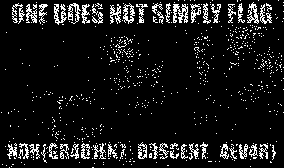
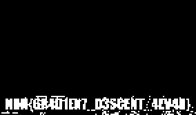
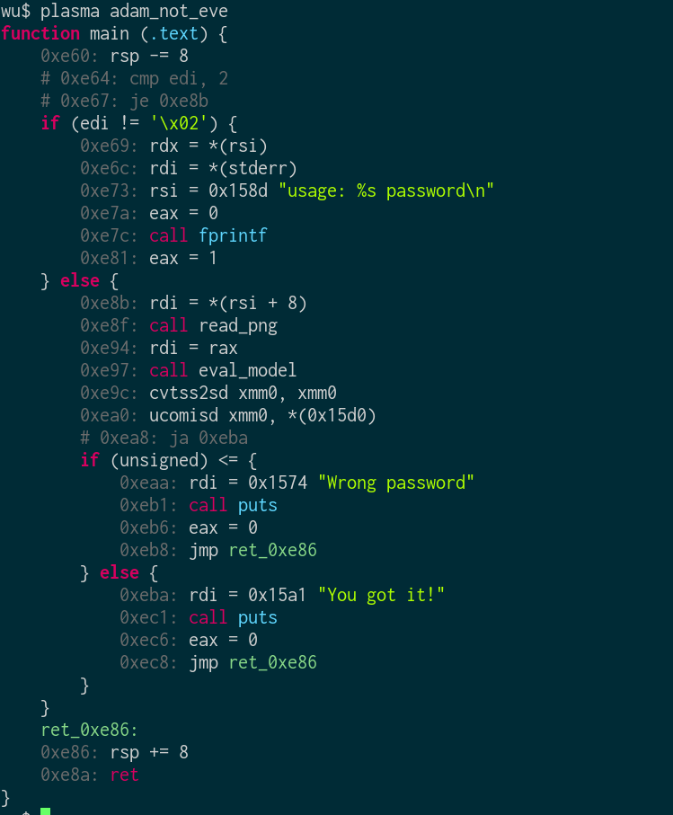
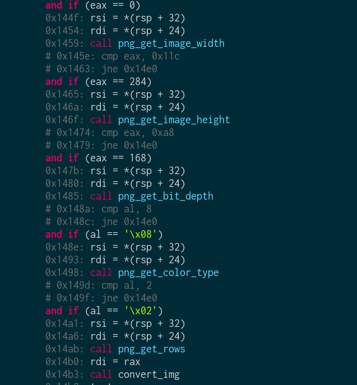

# NDH wargame 2018 : reverse 850

**Category:** reverse |
**Name:** dans la vallee |
**Solves:** 0 |
**Description:** Reverse a machine learning model embeded in an ELF binary.

___
## TLDR
This challenge is about reversing a machine learning model embeded in an ELF binary to find the flag. The binary prints "You got it!" or "Wrong password" if the given png file contains the flag or not. We solved this challenge by instrumenting this binary to use the embeded machine learning model for analyzing each pixel one by one. Here is the result:

|  |  |

Flag: NDH{GR4DIEN7_D3SCEN7_4EVER}


## Reverse

As we can see here with the [plasma](https://github.com/plasma-disassembler/plasma) tool, the binary:
- Expects a PNG filename in arguments
- Uses the *read_png* function to open the PNG and perform some check like *png_get_image_height() == 284 && png_get_image_width() == 168 && png_get_bit_depth() == 8 && png_get_color_type() == 2*
- Uses the *eval_model* function that loads a machine learning model embeded in the ELF and evalutates if the PNG contains the flag or not, then returns  a float value between 0 and 1
- if float_value > 0.9 then prints "You got it!" else prints "Wrong passwords".

| plasma adam_not_eve | plasma -x read_png adam_not_eve |
| --- | --- |
|  |  |


## Machine Learning Model

A basic homemade 4 layers Neural Network using sigmoid and relu as activation functions, there is only one output cell to say the input contains the flag or not.

## Instrumentation

At first we used this gdb script to breakpoint after the evaluation and print the float value, but it was too slow so we asked @XeR to manually rewritte the binary to write the float value before exiting. [@XeR](https://github.com/XeR) is a cheap tool and more optmimized than frida or gdb, pintool or whatever...

In order to do so, he wrote a small assembly code that outputs the _xmm0_
register, no matter how, and exit right afterward.

The following code can be compiled with `gcc -c shell.s`
```asm
.intel_syntax
.global _start

_start:
	# Store xmm0 on the stack
	movss [%rsp], %xmm0

	# write(stdout, stack, 8)
	mov %rax, 1
	mov %rdi, 1
	mov %rsi, %rsp
	mov %rdx, 8
	syscall

	# exit(0)
	mov %rax, 60
	mov %rdi, 0
	syscall
```


The patch is to be applied at address 0x0E9C. The best way to patch the binary
is to use the following commands :

```sh
objcopy -O binary shell.o shell.bin
dd if=shell.bin of=adam_not_eve bs=1 seek=$[0xE9C] conv=notrunc
```

Or, if you're a jackass, you can use `objdump` to read the opcodes, and `vim` +
`xxd` as an hex editor. (`dd` is hard at 5 am)


| [gdb script](gdb.gdbinit) | [manually rewrited binary](fast) | [original binary](adam_not_eve) |
| --- | --- | --- |

## Solution

Using a bit of python we generate a 168 by 284 pixels black PNG and evaluate this black PNG with the model, the returned value will be our threshold. Then we change a pixel in the image, if the neural network output for this new image is higher than the threshold then the new pixel is saved.

```sh
threshold = evaluate(full_black_png)

foreach pixel of full_black_png:
  pixel = white_color
  if threshold < evaluate(full_black_png_with_one_white_pixel):
    final_png.pixel = white_color
```

checkout [simple.py](simple.py) we also have a multihreaded version [gen.py](gen.py)
----
[HexpressoTeam](https://twitter.com/HexpressoCTF)

Players: [zma](https://twitter.com/_zm_a), [zbetcheckin](https://twitter.com/zbetcheckin), [XeR](https://github.com/XeR), [rawger](https://twitter.com/_rawger), [pix](https://twitter.com/pix), [jet](https://twitter.com/___jet_), [dev2lead](https://twitter.com/dev2lead), [chaignc](https://twitter.com/chaignc), [bitk](https://twitter.com/BitK_), Beuc


